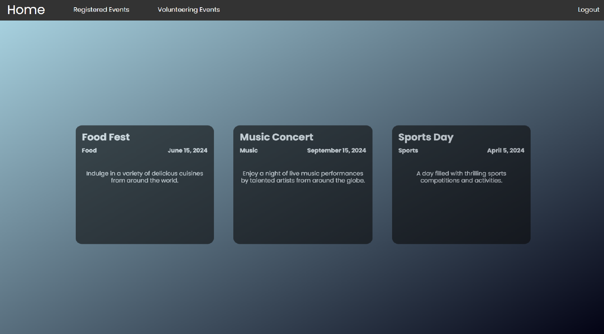
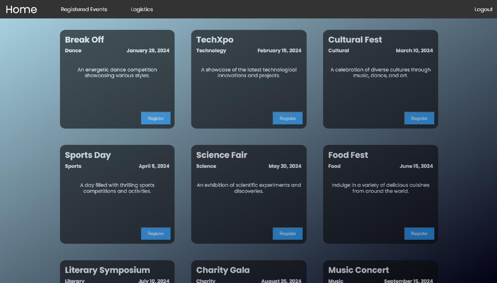
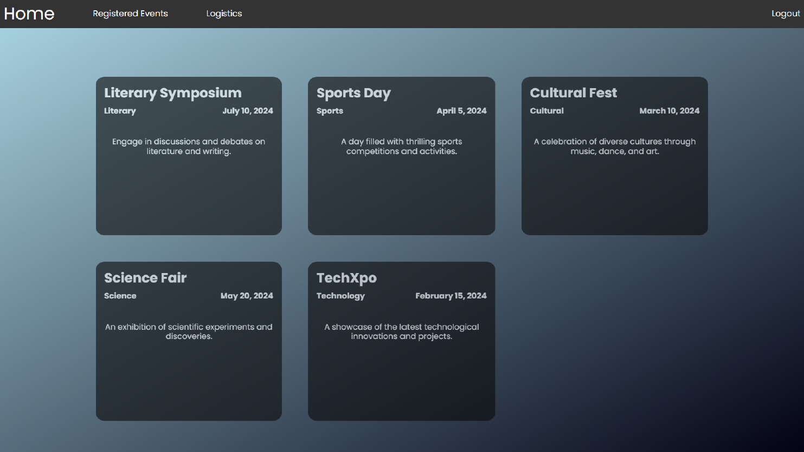
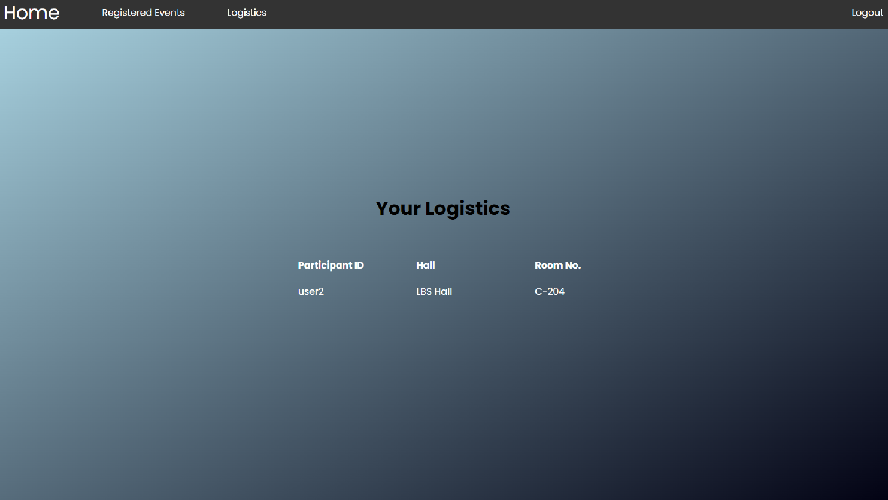
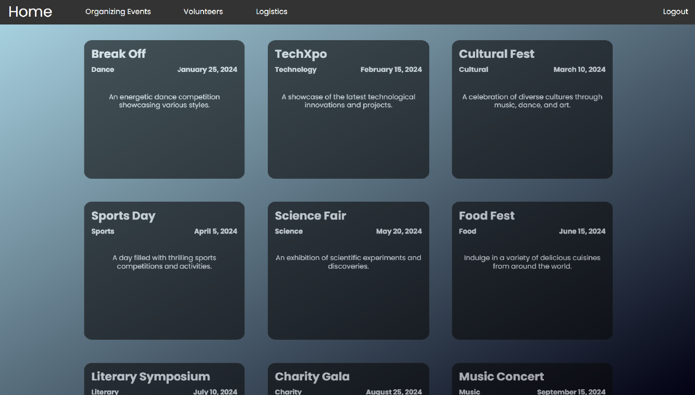
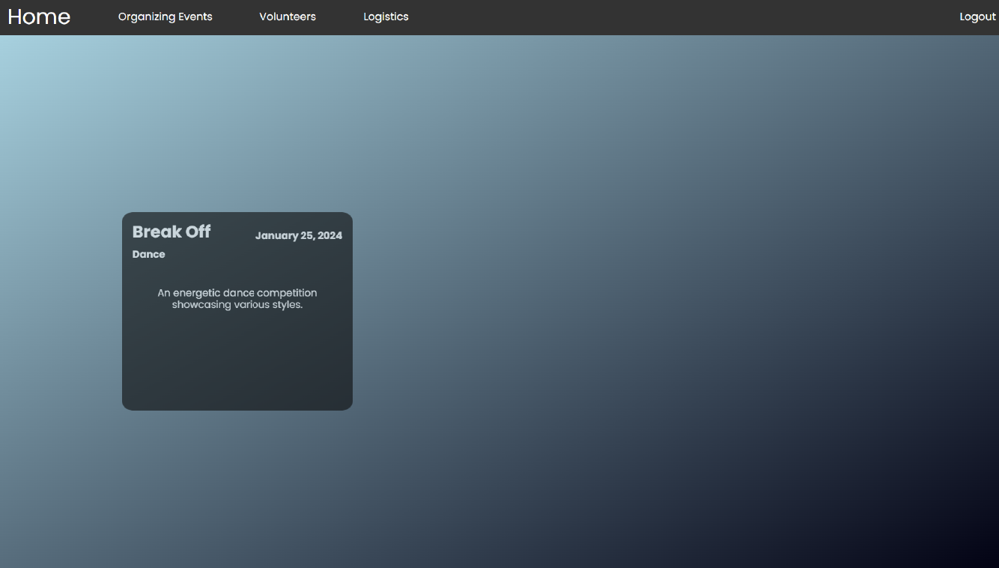
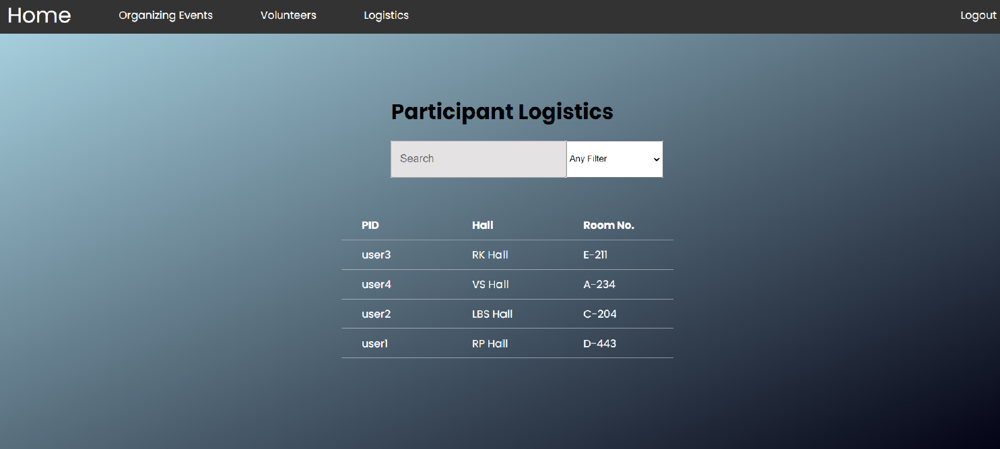
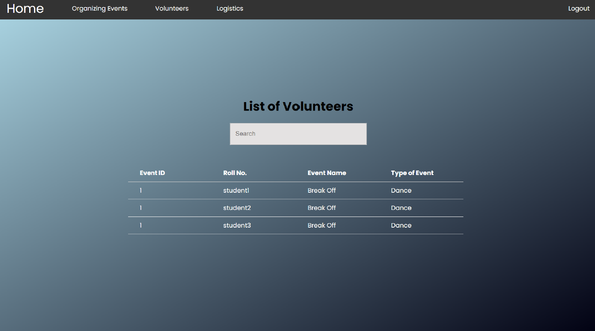
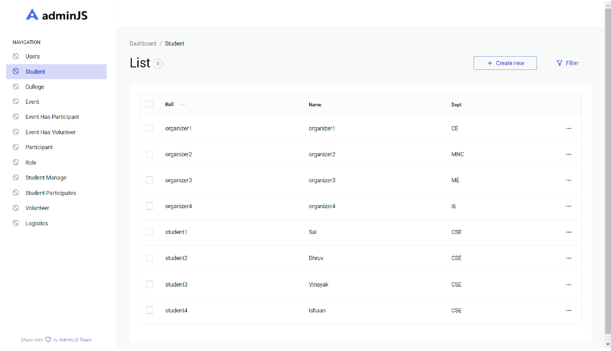

# College Festival Management System

## Description

In this project I built a web application for College Festival Management, this application is a goto for every person/user involved in organising college fest, participaitng in college fest, Managing events, logistics.
In this project the focus is more on how database works, how it is integrated to a useful web application with different functionalities.

## Tech Stack

- ReactJS for frontend
- NodeJS for backend

## Database

- PostgreSQL
A remote or local database can be connected.\
Add a file nammed db.js in the server folder and pase the following code.\
```bash

import * as pg from 'pg'
const { Pool } = pg.default;


const pool = new Pool({
    user: "USER_NAME",
    password: "PASS",
    host: "localhost",
    port: port_no,
    database: "postgres"
});

export default pool;

```

Replace the following:\
USER_NAME : PostgreSQL username in the local/remote server\
PASS : password of the database\
port_no : Port on which the database is accessible

## Run

Add the db.js file as shown in the Database part above.

Run client app using the following commands:

change the working directory to client/my-app then run
```bash
npm start

```

Run server app using the following commands:

Change the working directory to server then run
```bash
npm start

```

## Demo(Screenshots)

### Signin Page


### Signup Page


### Interface for Students
#### Home Page


#### Registered Events Page


#### Volunteering Events Page


### Interface for External Participants
#### Home Page


#### Registered Events Page


#### Logistics


### Interface for Organizers
#### Home Page
All Events in the fest\


#### Organizing events
Events organized by a particular organizer\


#### Participants Logistics


#### List of volunteers in the organizing events


### Admin Interface



